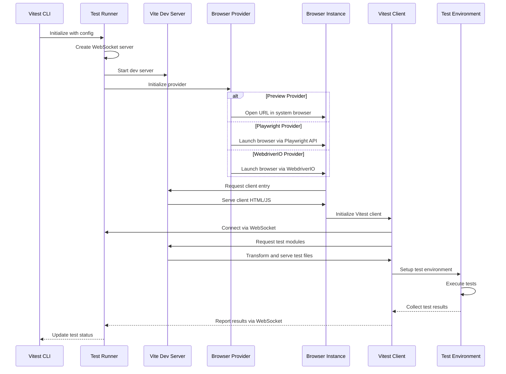

```mermaid
sequenceDiagram
    participant CLI as Vitest CLI
    participant Runner as Test Runner
    participant Vite as Vite Dev Server
    participant Provider as Browser Provider
    participant Browser as Browser Instance
    participant Client as Vitest Client
    participant Env as Test Environment

    CLI->>Runner: Initialize with config
    Runner->>Runner: Create WebSocket server
    Runner->>Vite: Start dev server
    Runner->>Provider: Initialize provider
    
    alt Preview Provider
        Provider->>Browser: Open URL in system browser
    else Playwright Provider
        Provider->>Browser: Launch browser via Playwright API
    else WebdriverIO Provider
        Provider->>Browser: Launch browser via WebdriverIO
    end
    
    Browser->>Vite: Request client entry
    Vite->>Browser: Serve client HTML/JS
    Browser->>Client: Initialize Vitest client
    Client->>Runner: Connect via WebSocket
    
    Client->>Vite: Request test modules
    Vite->>Client: Transform and serve test files
    Client->>Env: Setup test environment
    Env->>Env: Execute tests
    
    Env-->>Client: Collect test results
    Client-->>Runner: Report results via WebSocket
    Runner-->>CLI: Update test status
```