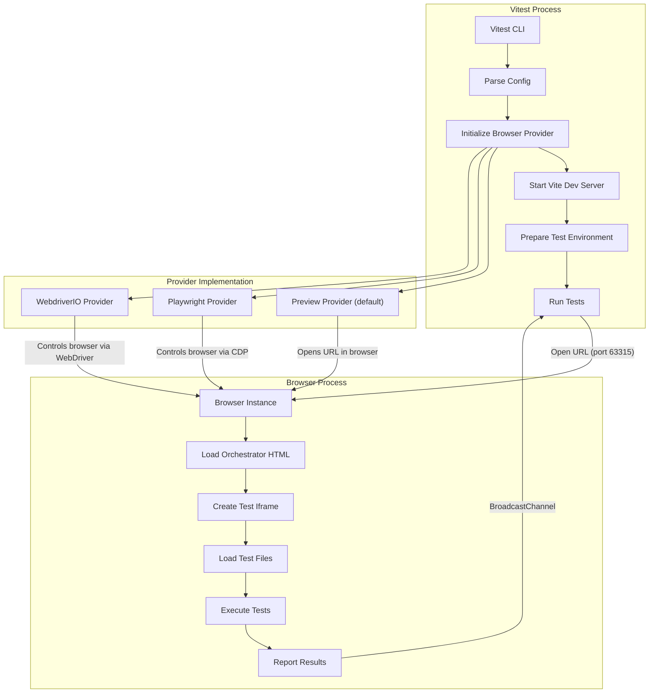

```mermaid
flowchart TD
    subgraph "Vitest Process"
        A[Vitest CLI] --> B[Parse Config]
        B --> C[Initialize Browser Provider]
        C --> D[Start Vite Dev Server]
        D --> E[Prepare Test Environment]
        E --> F[Run Tests]
    end

    subgraph "Browser Process"
        G[Browser Instance] --> H[Load Orchestrator HTML]
        H --> I[Create Test Iframe]
        I --> J[Load Test Files]
        J --> K[Execute Tests]
        K --> L[Report Results]
    end

    F -->|"Open URL (port 63315)"| G
    L -->|"BroadcastChannel"| F

    subgraph "Provider Implementation"
        M["Preview Provider (default)"] -->|"Opens URL in browser"| G
        N["Playwright Provider"] -->|"Controls browser via CDP"| G
        O["WebdriverIO Provider"] -->|"Controls browser via WebDriver"| G
    end

    C --> M
    C --> N
    C --> O
```
